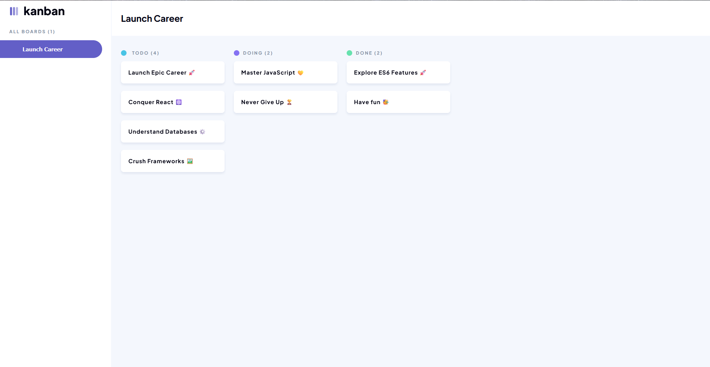
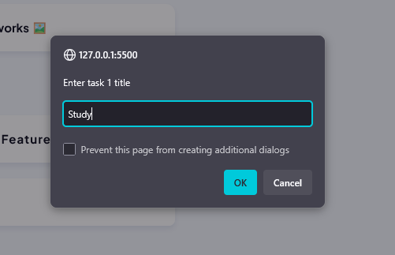
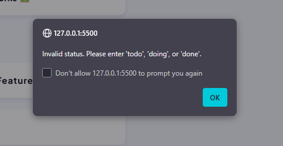
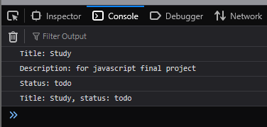
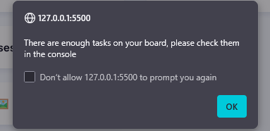

# Responsive Kanban Board

A visually accurate and fully responsive **Kanban board** built to replicate the provided Figma design.  
The application features multiple task columns, styled task cards, and a static side panel for a professional and cohesive user experience.

---

## 🚀 Features

- **Custom Branding**
  - Favicon and page title match the application’s theme.
- **Kanban Board Layout**
  - Multiple columns (e.g., *To Do*, *In Progress*, *Done*) following the exact Figma layout.
- **Pixel-Perfect Styling**
  - Colours, typography, spacing, and shadows match Figma specifications.
- **Fully Responsive**
  - Adapts seamlessly between desktop and mobile views as per Figma’s responsive design.
- **Task Cards**
  - Styled cards with clear titles, borders, padding, and shadows for easy readability.  
  - **Hover effects and transitions** for smooth and engaging interactivity.
- **Static Side Panel**
  - Contains correct icons, text, and branding elements, structured for a polished look.

---

## 📱 Responsiveness

- **Desktop/Laptop** → Full Kanban board with side panel.
- **Mobile** → Compact design that maintains usability and readability.

---

## 2. JavaScript Task Entry System

A JavaScript-based system that allows users to input three tasks with full details while ensuring data validation and consistency.

### Features
- Prompt users to enter **title**, **description**, and **status** for two tasks
- Automatically converts status input to **lowercase**
- Validates status to accept only `todo`, `doing`, or `done`, prompting repeatedly until valid
- Displays **completed tasks** (status: `done`) in the console
- Shows a motivational message if no tasks are completed:  
  `"No tasks completed, let's get to work!"`  
- Assigns **unique incremental IDs** to each task
- Alerts users when the **last allowed task** is added

---

## 🛠️ Tech Stack

- **HTML**  
- **CSS** 
- **JavaScript**  

---

## 📸 Kanban Board Preview

### Desktop View

### Mobile View

---

## 📷 Javascript task entry system preview  

### User Input View  

### Invalid Status  

### Console Log Output  

### Task Limit Alert
  

### console array output
